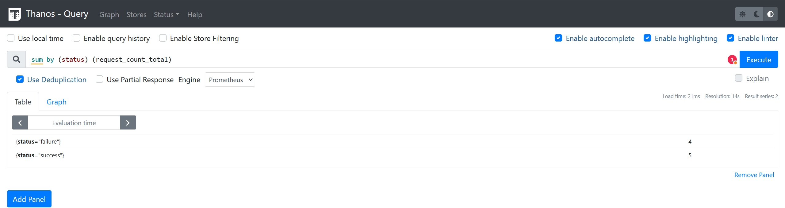
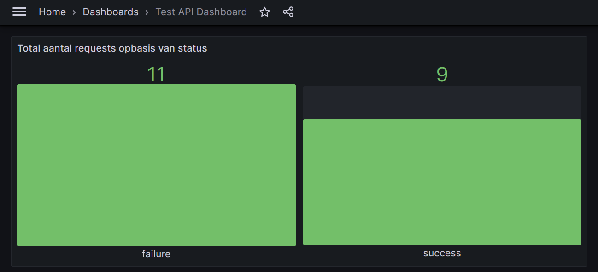

# Thanos snapt je devops together
hier 'Conclusie/ samenvatting' 


# Wat is Thanos en hoe red het je?
Weet je al wat Prometheus (Prometheus, z.d.) is? De volgende monitoring tool; Thanos (Thanos Metrics, z.d) werkt is namelijk dependent op Prometheus. Het is handig om te weten te weten wat Prometheus doet, ik raad je aan om een korte introductie over Prometheus te lezen van: Tigera, 2024 of de blog van mijn collega Mitchel te lezen! 

Thanos is een extensie voor Prometheus die zich richt op het verbeteren van de schaalbaarheid, beschikbaarheid en persistentie van metrics in een gedistribueerde omgeving. Thanos kan dus niet zelfstandig opereren. Wanneer Thanos wordt ingezet, blijft Prometheus in zijn rol als een time-series database en metrics scraper werken. 

Voordat ik wat meer vertel over de voordelen en details van Thanos moet ik eerst de belangrijke details en architectuur uitleggen van Thanos.

## Thanos componenten
Laten we eerst kijken uit welke onderdelen Thanos bevat en welke interactie er is met Prometheus.

### Sidecar
Eén van de belangrijkste is de ‘sidecar’ (Thanos Metrics, z.d.-d).
De sidecar dient zich als een interface tussen Prometheus en de opslag van Thanos. 
Het zorgt ervoor dat de block data (What Is Block Storage?, Oracle. z.d.) die Prometheus periodiek genereert, 
geüpload wordt naar een long-term storage systeem. 
Zoals een object store (data-opslag waarin data wordt opgeslagen als objecten,
in tegenstelling tot de traditionele hiërarchische bestandsstructuren (What Is Object Storage? Use Cases & Benefits | Google Cloud, z.d.)
(bijv. Amazon S3 (Amazon S3 - Cloud Object Storage - AWS, z.d.) of een vergelijkbare lokale oplossing). Deze wordt gekoppeld aan een Prometheus server.

### Store Gateway
die queries mogelijk maakt over zowel de lokale data als de opgeslagen data in de object store. Hierdoor is het mogelijk om oudere metrics op te vragen zonder dat de oorspronkelijke Prometheus instance beschikbaar hoeft te zijn.


Als de Sidecar data back-upt in de object storage kun je de retentieperiode (de tijdsduur waarvoor data wordt bewaard voordat deze wordt verwijderd of overschreven) van Prometheus verkorten om minder data lokaal op te slaan. Echter, om al deze historische data opnieuw op te vragen, hebben we een manier nodig om toegang te krijgen tot die data. De Store Gateway helpt bij de toegang tot hositorsche data door dezelfde API te implementeren als de Sidecar, maar het doet dit door de data te benaderen die het in de object storage kan vinden. Net als sidecars en query nodes, stelt de Store Gateway een Store API beschikbaar en moet deze door de Querier (hier later meer over) worden gedetecteerd.

```
thanos store \ --data-dir /var/thanos/store \ # Schijfruimte voor lokale caches --objstore.config-file bucket_config.yaml \ # Bucket om data uit op te halen --http-address 0.0.0.0:19191 \ # HTTP endpoint voor het verzamelen van metrics over de Store Gateway --grpc-address 0.0.0.0:19090 # GRPC endpoint voor StoreAPI
```

### Querier
Als je één of meerdere Sidecars hebt opgezet bij verschillende Prometheus instanties wil je kun je doormiddel van de Thanos Querier queries over alle instanties heen uitvoeren. De Querier fungeert als een [federated query-engine](https://blog.devgenius.io/understanding-federated-query-engines-624c57435118) die data verzamelt van meerdere Prometheus-instanties en Thanos componenten om een uniform overzicht van metrics te bieden, waardoor cluster-overschrijdende queries mogelijk zijn met één enkele API i.p.v. alle individuele instanties.

Dit lost het probleem van [Prometheus federation denk ik deze bron, nog ff nakijken later](https://last9.io/blog/prometheus-federation-guide/) elegant op.


### Downsampling
Thanos ‘downsampling mechanisme’ wordt uitgevoerd door de Compactor component (Thanos Metrics, z.d.-d), die verantwoordelijk is voor het optimaliseren en comprimeren van de opgeslagen metrics-data. Het downsampling-proces werkt door het verminderen van de resolutie van de data naarmate deze ouder wordt. Thanos gebruikt hiervoor drie verschillende graten van dataopslag:
1.	Raw data (5s resolutie): De originele, onbewerkte metrics zoals ze door Prometheus zijn verzameld. Deze resolutie biedt de meest gedetailleerde inzichten en wordt bewaard voor kortetermijnanalyses.
2.	5m downsampled data: Zodra de metrics ouder worden, past de Compactor een gemiddelde toe over intervallen van 5 minuten, wat de opslagruimte aanzienlijk reduceert zonder de essentie van de trends in de data te verliezen.
3.	1h downsampled data: Voor de langetermijnarchivering wordt een nog grovere resolutie toegepast, waarbij data wordt geaggregeerd over intervallen van een uur. Deze resolutie is ideaal voor het bekijken van historische trends over een lange periode.

Het proces van downsampling gebeurt vervolgens in 2 stappen:
1.	5-minuten resolutie: Alle metrics met de originele resolutie (raw resolution) die ouder zijn dan 40 uur, worden gedownsampled naar een resolutie van 5 minuten. Dit betekent dat datapunten worden geaggregeerd zodat er slechts één datapunt per 5 minuten overblijft.
2.	1-uur resolutie: Vervolgens, als de metrics met een 5-minuten resolutie ouder zijn dan 10 dagen, worden ze verder gedownsampled naar een resolutie van 1 uur.

## Architectuur

Nu ik heb verteld over de belangrijkste onderdelen ga ik de volledige architectuur in beeld brengen. Dit zit er zo uit:


Bron: https://docs.google.com/drawings/d/e/2PACX-1vSJd32gPh8-MC5Ko0-P-v1KQ0Xnxa0qmsVXowtkwVGlczGfVW-Vd415Y6F129zvh3y0vHLBZcJeZEoz/pub?w=960&h=72

In deze afbeelding komen de eerder besproken componenten duidelijk naar voren, zoals de Sidecar, Store Gateway, Querier en de Compactor. De afbeelding illustreert hoe data vanuit Prometheus naar de object storage stroomt en hoe Thanos componenten deze data kunnen verwerken en opvragen.

Eén component die ik in deze blog niet heb behandeld is de Ruler. Deze is component zorgt voornamelijk voor het evalueren van Prometheus alerting en recording rules, zelfs op basis van historische data. Dit maakt het mogelijk om ook bij storingen betrouwbare alerts te genereren.

## Verbinding met Prometheus
Ik ga er vanaf nu vanuit dat je een goed idee hebt wat Prometheus doet. Prometheus heeft onderanderen beperkingen op het gebied van schaalbaarheid en long-term dataopslag: 'Prometheus's local storage is not intended to be durable long-term storage; external solutions offer extended retention and data durability.' (Prometheus, z.d.-b).

Thanos bouwt voort op de kracht van Prometheus door deze beperkingen aan te pakken. Thanos werkt als een laag bovenop Prometheus en biedt mogelijkheden zoals long-term storage, high availability, en globale query-functionaliteiten. Dit betekent dat Thanos niet de data scraping of metric-verzameling van Prometheus vervangt, maar deze juist uitbreidt door alle verzamelde data op te slaan in een schaalbare object storage. Thanos maakt het eenvoudiger om op te schalen naar meerdere Prometheus-instanties en biedt één enkel overzicht van al deze metrics, zonder de noodzaak om Prometheus' federatiefuncties te gebruiken.

## Welke problemen lost Thanos op?

Thanos biedt een reeks oplossingen voor beperkingen en problemen die inherent zijn aan een standaard Prometheus-implementatie. Prometheus, heeft het duidelijke beperkingen als het gaat om schaalbaarheid, data-retentie en high availability (HA). Hier is hoe Thanos deze uitdagingen aanpakt:
1. Lange-termijn opslag en schaalbaarheid: Thanos gebruikt object storage om de beperkte dataretentie van Prometheus te omzeilen, waardoor metrics jarenlang kunnen worden bewaard zonder dure lokale opslag. 
2. High Availability (HA): Door datareplicatie en gedecentraliseerde query's zorgt Thanos ervoor dat metrics beschikbaar blijven, zelfs bij serveruitval. Dit voorkomt dat een enkele Prometheus-instance een single point of failure is. 
3. Global Query View: Met de Thanos Querier wordt een globale querylaag mogelijk gemaakt die metrics van meerdere Prometheus-instances verzamelt. Dit vereenvoudigt het monitoren van cluster-overschrijdende metrics zonder de complexiteit van Prometheus-federatie. 
4. Downsampling: Thanos comprimeert oudere data naar lagere resoluties met de Compactor, waardoor opslagkosten worden verlaagd en query-prestaties worden verbeterd zonder belangrijk trendinzicht te verliezen. 
5. Multi-cluster monitoring: Thanos biedt naadloze multi-cluster ondersteuning, waarbij metrics van verschillende locaties worden samengebracht in één overzicht. Dit maakt het uitermate geschikt voor gedistribueerde cloud-native omgevingen.

#### BRONNEN HIER NOG BIJ
Bijv bron wat prometheus faal punten zijn
En dingen referen in de eerder gemaakte in de blog
zeker nog wat compacter maken

# Een applicatie met Thanos
https://www.docker.com/

Ik ga nu een stukje hand-ons behandelen waar ik een voorbeeld applicatie met Thanos maak. Om mee te doen moet je al Docker geïnstalleerd hebben. Om het in dit voorbeeld behapbaar te laten heb ik een redelijk eenvoudige Docker compose gemaakt met enkele extra configuraties. Dit code kan je vinden in de GitHub repo bij: `src/project`

De inhoud van het project ziet er zo uit:

```
.
├── docker-compose.yml
├── prometheus.yml
├── thanos/
│   └── objstore.yml
└── grafana/
    └── provisioning/
        ├── datasources/
        │   └── datasource.yml
        └── dashboards/
            ├── dashboard.yml
            └── dashboards/
                └── test-api-dashboard.json
```

Dit zijn allemaal configuratie bestanden. Zoals In `prometheus.yml` staat welke containers hij moet gaan scrapen:
```
  ...
  - job_name: 'test-api'
    static_configs:
      - targets: ['test-api:5000']
    metrics_path: /metrics
```

En in de verschillende Grafana (Grafana is eigenlijk optioneeel maar wel leuk om de resultaten te zien) configuratie bestanden staat bijvoorbeeld een dashboard met visuele weergeven van de test-api:

- `test-api-dashboard.json` met de inhoud:
```
{
  "annotations": {
    "list": [
      {
        "builtIn": 1,
        "datasource": "-- Grafana --",
        "enable": true,
        "hide": true,
        "iconColor": "rgba(0, 211, 255, 1)",
        "name": "Annotations & Alerts",
        "type": "dashboard"
      }
    ]
  },
  ...
      "targets": [
        {
          "expr": "sum by (status) (request_count_total)",
          "interval": "",
          "legendFormat": "{{status}}",
          "refId": "A"
        }
      ],
      "title": "Total aantal requests opbasis van status",
      "type": "bargauge"
    }
  ],
  "schemaVersion": 30,
  "title": "Test API Dashboard",
  "version": 1
}
```

En uiteraard staat in de `docker-compose.yml` alle verschillende services met benodigde informatie zoals naam, port, image en eventuele start commando:
```
services:
  ..   
  thanos-sidecar:
    image: quay.io/thanos/thanos:v0.32.2
    container_name: thanos-sidecar
    user: "0"  # Run as root user to avoid permission issues
    command:
      - sidecar
      - --prometheus.url=http://prometheus:9090
      - --grpc-address=0.0.0.0:10901
      - --http-address=0.0.0.0:10902
      - --tsdb.path=/prometheus
      - --objstore.config-file=/etc/thanos/objstore.yml
    volumes:
      - prometheus-data:/prometheus   # Shared volume with Prometheus
      - ./thanos/objstore.yml:/etc/thanos/objstore.yml
    networks:
      - monitoring
    depends_on:
      - prometheus
  ...

  thanos-query:
    image: quay.io/thanos/thanos:v0.32.2
    container_name: thanos-query
    command:
      - query
      - --http-address=0.0.0.0:9090
      - --store=thanos-sidecar:10901
      - --store=thanos-store:10901
    ports:
      - "19090:9090"
    networks:
      - monitoring
    depends_on:
      - thanos-sidecar
      - thanos-store

  ... 
  volumes:
    prometheus-data:
      driver: local
    thanos-data:
      driver: local
    grafana-storage:
      driver: local
  
  networks:
    monitoring:
      driver: bridge
```

Kijk gerust op je gemak naar alle configuratie bestanden om alles te bekijken.

Nog even handig om te weten: ae API is heen heel simpel Python programam dat met een random functie een succes (200) terug stuurd of een: fail (500). Deze staat op Docker als een image, maar kan je ook vinden in het project. 

Start de omgeving door het commando: `Docker compose up -d` uit te voeren.  

Deze omgeving monitort systeem- en applicatieprestaties met Prometheus voor het verzamelen van metrieken, uitgebreid door Thanos voor lange-termijnopslag en multi-cluster analyse. 
Grafana visualiseert deze metrieken in dynamische dashboards, wat inzicht biedt in de status en prestaties van het systeem en de applicaties.

- **Prometheus** (`http://localhost:9090`)
  - Hier kun je de status van het systeem controleren en PromQL-queries uitvoeren om metrieken te analyseren. Prometheus verzamelt en bewaart metrieken van verschillende bronnen, waaronder de `test-api`, en stelt je in staat om gedetailleerde statistieken en grafieken te maken.

- **Thanos Query** (`http://localhost:19090`)
  - Deze interface biedt een uitgebreide zoek- en analysemogelijkheid voor lange-termijn metrieken door verschillende Prometheus-instances te combineren. Je kunt queries uitvoeren die historische data raadplegen en aggregeren, met ondersteuning voor multi-cluster Prometheus-installaties.

- **Grafana** (`http://localhost:3000`). Login met de username: admin en wachtwoord: admin
  - Grafana wordt gebruikt voor het visualiseren van de metrieken in dynamische en interactieve dashboards. Het biedt integraties met meerdere databronnen, zoals Thanos, en stelt je in staat om aangepaste dashboards te maken met verschillende soorten grafieken en monitoringwidgets.

- **Test API** (`http://localhost:5000/api`)
  - Dit endpoint simuleert een willekeurige succesvolle of mislukte respons, wat gebruikt wordt om de request-statistieken bij te houden. De status van deze respons wordt vervolgens verwerkt als metrieken in Prometheus en Thanos.

- **Test API Metrics** (`http://localhost:5000/metrics`)
  - Hier kun je de ruwe metrieken van de `test-api` bekijken die Prometheus verzamelt. Het toont statistieken zoals het totale aantal verzoeken en de status van elke respons, wat nuttig is voor het volgen van de prestatie van de API.

Bij Thanos (http://localhost:19090/stores) kun je mooi zien hoe de sidecar is verbonden aan de test-api. Roep of bezoek: http://localhost:5000/api een aantal keer om het resultaat te kunnen zien.
Gebruik de commando: `sum by (status) (request_count_total)` in Thanos (en of Prometheus) de resultaten van de test-api te zien. Dit ziet er bijvoorbeeld zo uit:


Controleer of bijvoorbeeld Prometheus dezelfde informatie laat zien. Als laatst is het ook leuk om het dashboard te bekijken van Grafana. Dit ziet er zo uit:


#**Misschien weg:!!! !  !!**

- **Opmerking over deze setup**
  - Deze configuratie is een eenvoudige setup met weinig schaalbaarheid, wat betekent dat je mogelijk niet meteen de volledige voordelen van Thanos kunt zien. Thanos is vooral krachtig wanneer je werkt met grote, gedistribueerde Prometheus-instellingen over meerdere clusters.
  - Voor meer geavanceerde toepassingen en om de schaalbaarheid van Thanos te benutten, kun je kijken naar:
  - **Dit later nog ff aanpassen!!!::::::**
    - [Thanos Best Practices](https://thanos.io/tip/thanos/getting-started.md/#best-practices) voor aanbevelingen over het implementeren in productie-omgevingen.
    - [Kubernetes met Thanos](https://thanos.io/tip/thanos/kubernetes.md/) voor voorbeelden van hoe je Thanos kunt integreren in een Kubernetes-omgeving met volledige schaalbaarheid.
    - [Prometheus Federation](https://prometheus.io/docs/prometheus/latest/federation/) als een alternatief of aanvulling op Thanos voor het schalen van je metriekenverzameling over meerdere clusters.
  - Als je geïnteresseerd bent in grotere setups met Docker, overweeg dan een blik te werpen op ... Zelf nog ff doen! 

# Voor en nadelen 
Voordelen van Thanos zijn: 

1. **Schaalbaarheid en Lange-termijn opslag**: Thanos maakt het eenvoudig om metrics op te slaan in schaalbare object storage zoals S3, waardoor gegevens veilig bewaard kunnen worden voor lange termijn analyses. Dit maakt het geschikt voor multi-cluster monitoring en grote datasets zonder dat de opslagcapaciteit van Prometheus wordt overschreden (Valialkin, 2021).
2. **Global Query View en High Availability (HA)**: Thanos biedt een global query view door gegevens uit verschillende Prometheus-instances samen te voegen. Dit verhoogt de beschikbaarheid door automatische datareplicatie en het elimineren van single points of failure (Thanos Vs Cortex | Last9, z.d.).
3. **Data Deduplicatie**: Thanos biedt geavanceerde deduplicatie van data uit meerdere Prometheus-instances, wat handig is bij setups met hoge beschikbaarheid. Dit zorgt ervoor dat je geen dubbele data hebt, waardoor de opslagruimte optimaal wordt benut (Wilkie, 2023).
4. **Flexibiliteit en Integratie**: Thanos integreert soepel met bestaande Prometheus-omgevingen zonder de noodzaak om veel wijzigingen aan te brengen. Dit maakt het eenvoudiger om Thanos geleidelijk te adopteren (Quiroz-Vázquez, 2024).
5. **Downsampling**: Thanos ondersteunt downsampling, wat betekent dat oudere data wordt opgeslagen met een lagere resolutie. Dit vermindert de hoeveelheid data die nodig is zonder de kerninformatie te verliezen (Blog, 2023).

En de nadelen van Thanos zijn:

1. **Complexiteit**: De setup van Thanos kan ingewikkeld zijn, met meerdere componenten zoals Sidecar, Querier, Compactor, en Store Gateway die allemaal correct moeten worden ingesteld. Dit maakt de leercurve vrij hoog. Als je een idee wil hebben hoe de volledige installatie eruitziet, bekijk deze bron (Stankowski, 2024) (Stankowski, 2024-b).
2. **Hoge kosten voor object storage**: Het gebruik van object storage zoals S3 kan kostbaar zijn. Dit kan een belemmering vormen voor bedrijven met een beperkt budget voor opslag. Thanos raadt af om zelf de data lokaal op te slaan (Blogger, 2023). Ook al is er compressie van data, op lange termijn zal er een aanzienlijk groot archief ontstaan.

# Anderen monitoring tools

Zoals ik al eerder heb besproken is Thanos een krachtige uitbreiding van Prometheus, ontworpen voor lange-termijn opslag en multi-cluster monitoring. Het biedt een global query view en maakt het mogelijk om data uit meerdere bronnen te combineren. Thanos is ideaal voor organisaties met bestaande Prometheus-infrastructuren die schaalbaarheid en hoge beschikbaarheid nodig hebben. De setup kan echter complex zijn vanwege de vele componenten en de kosten kunnen oplopen door het gebruik van object storage zoals S3 (Thanos metrics, z.d.-c).

VictoriaMetrics onderscheidt zich door zijn eenvoud en hoge prestaties. Het biedt een directe integratie met Prometheus en vereist geen complexe componenten zoals sidecars. VictoriaMetrics is kostenefficiënt dankzij sterke on-disk compressie, wat leidt tot lagere opslagkosten. Het is de ideale keuze voor snelle data-inname en verwerking, en presteert goed bij grootschalige datasets, wat het geschikt maakt voor bedrijven die focussen op lage operationele kosten (VictoriaMetrics: Simple & Reliable Monitoring For Everyone, z.d.).

OpenTelemetry biedt de breedste flexibiliteit door ondersteuning voor metrics, traces en logs. Het is niet beperkt tot alleen metrics, zoals Prometheus, en kan eenvoudig integreren met diverse backends voor opslag en query's. OpenTelemetry is ideaal voor organisaties die een volledige observability-strategie willen implementeren. Het vereist echter meer configuratie en heeft geen ingebouwde opslag, waardoor het vaak samen met andere tools zoals Prometheus wordt gebruikt om metrics te beheren (Quiroz-Vázquez, 2024) (Blackwood-Sewell, 2024).

## Use-cases
- Thanos: Perfect voor bedrijven die lange-termijn opslag en schaalbare multi-cluster monitoring nodig hebben met bestaande Prometheus-infrastructuren. 
- VictoriaMetrics: De beste keuze voor organisaties die op zoek zijn naar een eenvoudige en kosteneffectieve oplossing met hoge prestaties en lage opslagkosten
- OpenTelemetry: Het meest geschikt voor bedrijven die een complete observability-oplossing nodig hebben met metrics, logs en traces, en maximale flexibiliteit willen in hun monitoringstrategie.

# Thanos & DevOps?
Thanos versterkt de samenwerking tussen development en operations teams door een gecentraliseerde, schaalbare monitoringoplossing te bieden. 
Het verzamelt metrics van meerdere Prometheus-instanties en consolideert deze tot een uniforme dataview, 
waardoor beide teams toegang hebben tot consistente en betrouwbare gegevens. Dit gezamenlijke inzicht versnelt probleemoplossing en incidentrespons.

Met lange-termijn opslag van metrics stelt Thanos teams in staat om historische data te analyseren, wat helpt bij trendanalyse en capaciteitsplanning. 
De flexibele querymogelijkheden en ondersteuning voor PromQL maken het mogelijk om diepgaande analyses uit te voeren over verschillende omgevingen heen.

Daarnaast faciliteert Thanos integratie met CI/CD pipelines, waardoor metrics automatisch kunnen worden geanalyseerd tijdens deploys. 
Dit verbetert de feedbackloop tussen development en operations, bevordert continue verbetering en versterkt een DevOps-cultuur binnen de organisatie.

# Conclusie

# Bronnen
- Lijst