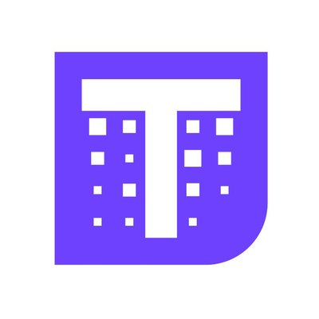
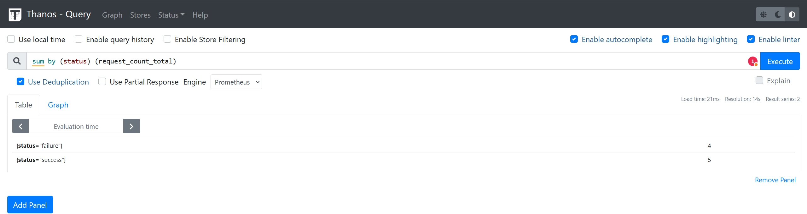
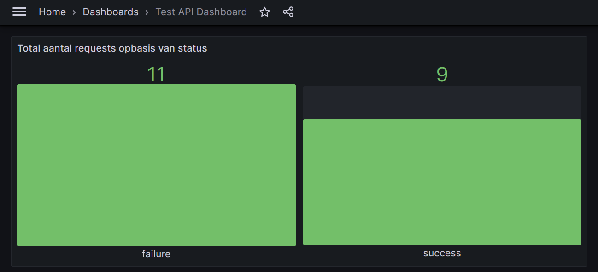

# De ultieme Endgame voor je metrics: Thanos



*[Jelmer Noppert, oktober 2024.](https://github.com/hanaim-devops/devops-blog-pietknoppert)*

Effectieve monitoring is essentieel in DevOps, maar Prometheus kent beperkingen op het gebied van schaalbaarheid en langdurige opslag. Thanos biedt de oplossing als de ultieme "Endgame" voor je metrics. In deze blog ontdek je hoe Thanos je monitoring kan versterken en je helpt om metrics op epische schaal te beheren.

<hr/>

## Wat is Thanos en hoe redt het je?

Thanos is een extensie voor Prometheus die schaalbaarheid, beschikbaarheid en langdurige opslag van metrics verbetert. Het is afhankelijk van Prometheus voor zijn basisfunctionaliteit.

Weet je al wat Prometheus (Prometheus, z.d.) is? Om Thanos goed te kunnen begrijpen raad ik je aan om een korte introductie over Prometheus te lezen van: Tigera, 2024 of de blog van mijn collega Mitchel te lezen!

### Thanos componenten

Laten we eerst kijken uit welke onderdelen Thanos bestaat en hoe het interacteert met Prometheus.

#### Sidecar

Een van de belangrijkste componenten is de ‘sidecar’ (Thanos Metrics, z.d.-d).
De sidecar fungeert als interface tussen Prometheus en Thanos, en uploadt block data naar een long-term storage (Oracle. z.d.), zoals een object store (data wordt opgeslagen als object, zie Google Cloud, z.d.).
Dit kan bijvoorbeeld met Amazon S3 (Amazon S3 - Cloud Object Storage - AWS, z.d.).

Iedere sidecar kan maar gekoppeld worden aan één Prometheus-server. Voor meerdere Prometheus instanties, heb je dus ook meerdere sidecars.

#### Store Gateway

De Store Gateway haalt historische data uit de object storage, waar de Sidecar deze data heeft opgeslagen.
Hierdoor is de retentieperiode (de tijdsduur waarvoor data wordt bewaard voordat deze wordt verwijderd of overschreven) van Prometheus korter door alleen recente data lokaal op te slaan terwijl oudere data in de object storage blijft.

#### Querier

Als je een of meerdere sidecars hebt opgezet bij verschillende Prometheus-instanties, kun je door middel van de Thanos Querier queries over alle instanties heen uitvoeren.
De Querier fungeert als een federated query-engine (Whitley, 2022) die data verzamelt van meerdere Prometheus-instanties en Thanos componenten om een uniform overzicht van metrics te bieden:
'Thanos Querier essentially allows to aggregate and optionally deduplicate **multiple metrics backends under single Prometheus Query endpoint.**' (Thanos Metrics, z.d.-f)


Afbeelding 1: Thanos Querier flow overview (Thanos metrics. z.d.-c)

### Downsampling

Thanos ‘downsamplingmechanisme’ wordt uitgevoerd door de Compactor-component (Thanos Metrics, z.d.-d), die verantwoordelijk is voor het optimaliseren en comprimeren van de opgeslagen metrics-data.
Thanos gebruikt hiervoor drie verschillende soorten dataopslag:

1. Raw data (5s resolutie): De volledige metrics zoals ze door Prometheus zijn verzameld.
2. 5m downsampled data: Gecomprimeerde data met intervallen van 5 minuten. Dit reduceert opslagruimte zonder de essentie van de trends in de data te verliezen.
3. 1h downsampled data: Voor de lange termijn archivering waarbij data wordt geaggregeerd over intervallen van een uur. Deze resolutie is voor het bekijken van historische trends over een lange periode.

Het proces van downsampling gebeurt vervolgens in twee stappen:

1. 5-minuten resolutie: Alle metrics met de originele resolutie (raw resolution) die ouder zijn dan 40 uur, worden gedownsampled naar een resolutie van 5 minuten. Er blijft dus één datapunt per 5 minuten over.
2. 1-uur resolutie: Vervolgens, als de metrics met een 5-minuten resolutie ouder zijn dan 10 dagen, worden ze verder gedownsampled naar een resolutie van 1 uur.

### Architectuur

Nu ik de belangrijkste onderdelen heb besproken, zal ik de volledige architectuur in beeld brengen. Deze ziet er zo uit:


Afbeelding 2: Thanos components overview met onderliggende interacties (Thanos Metrics, z.d.-g)

In afbeelding 2 komen de eerder besproken componenten duidelijk naar voren, zoals de Sidecar, Store Gateway, Querier en de Compactor. De afbeelding illustreert hoe data vanuit Prometheus naar de object storage stroomt en hoe Thanos componenten deze data kunnen verwerken en opvragen.

Een component die ik in deze blog niet heb behandeld is de Ruler. Dit component zorgt voornamelijk voor het evalueren van Prometheus alerting en recording rules (Prometheus, z.d.-c).

### Verbinding met Prometheus

Prometheus heeft onder andere beperkingen op het gebied van schaalbaarheid en long-term dataopslag: 'Prometheus's local storage is not intended to be durable long-term storage; external solutions offer extended retention and data durability.' (Prometheus, z.d.-b).

### Welke problemen lost Thanos op?

Thanos richt zich op onder andere deze onderwerpen:

1. **Long-term storage en schaalbaarheid**: Thanos gebruikt object storage waardoor metrics jarenlang kunnen worden bewaard zonder dat dure lokale opslag nodig is (Thanos metrics, z.d.-c).
2. **High Availability (HA)**: Door datareplicatie en gedecentraliseerde query's zorgt Thanos ervoor dat metrics beschikbaar blijven, zelfs bij serveruitval. Dit voorkomt dat een enkele Prometheus-instance een single point of failure wordt (Blogger, M., 2023).
3. **Global Query View**: Met de Thanos Querier wordt een globale querylaag gecreëerd die metrics van meerdere Prometheus-instances verzamelt (Thanos metrics, z.d.-f).
4. **Downsampling**: Thanos comprimeert oudere data naar lagere resoluties met de Compactor (zie hoofdstuk: Downsampling), wat opslagkosten verlaagt en query-prestaties verbetert.
5. **Multi-cluster monitoring**: Thanos biedt naadloze ondersteuning voor multi-clusteromgevingen, waarbij metrics van verschillende locaties worden samengebracht in één overzicht. Dit maakt het geschikt voor gedistribueerde cloud-native omgevingen (Thanos metrics, z.d.).

Met deze verbeteringen zorgt Thanos ervoor dat zowel development- als operations-teams beter inzicht hebben in systeemgedrag, wat leidt tot snellere probleemoplossing en efficiëntere samenwerking.

## Een applicatie met Thanos

Ik ga nu een stukje hands-on gedeelte behandelen waarin ik een voorbeeldapplicatie met Thanos bespreek. Om mee te doen moet je al Docker (Docker: Accelerated Container Application Development, 2024) geïnstalleerd hebben.

Om dit voorbeeld behapbaar te houden heb ik een redelijk eenvoudige Docker Compose gemaakt met enkele extra configuraties. Deze code kun je vinden in de GitHub-repository bij `src/project`

De inhoud van het project ziet er zo uit:

``` yml
.
├── docker-compose.yml
├── prometheus.yml
├── app.py
├── thanos/
│   └── objstore.yml
└── grafana/
    └── provisioning/
        ├── datasources/
        │   └── datasource.yml
        └── dashboards/
            ├── dashboard.yml
            └── dashboards/
                └── test-api-dashboard.json
```

Dit zijn allemaal configuratiebestanden. Bijvoorbeeld in `prometheus.yml` staat welke containers hij moet gaan scrapen:

``` yml
  ...
  - job_name: 'test-api'
    static_configs:
      - targets: ['test-api:5000']
    metrics_path: /metrics
```

En in een Grafana-configuratie (Grafana is eigenlijk optioneel, maar wel interessant om de resultaten te zien) staat bijvoorbeeld een dashboard met visuele weergave van de test-api:

- `test-api-dashboard.json` met de inhoud:

``` json
{
  "annotations": {
    "list": [
      {
        "builtIn": 1,
        "datasource": "-- Grafana --",
        "enable": true,
        "hide": true,
        "iconColor": "rgba(0, 211, 255, 1)",
        "name": "Annotations & Alerts",
        "type": "dashboard"
      }
    ]
  },
  ...
      "targets": [
        {
          "expr": "sum by (status) (request_count_total)",
          "interval": "",
          "legendFormat": "{{status}}",
          "refId": "A"
        }
      ],
      "title": "Total aantal requests op basis van status",
      "type": "bargauge"
    }
  ],
  "schemaVersion": 30,
  "title": "Test-api Dashboard",
  "version": 1
}
```

In de `docker-compose.yml` staan uiteraard alle verschillende services met benodigde informatie zoals naam, poort, image en eventuele startcommando. Hier een klein stukje van die compose:

``` yml
services:
  ..   
  thanos-sidecar:
    image: quay.io/thanos/thanos:v0.32.2
    container_name: thanos-sidecar
    user: "0"  # Run as root user to avoid permission issues
    command:
      - sidecar
      - --prometheus.url=http://prometheus:9090
      - --grpc-address=0.0.0.0:10901
      - --http-address=0.0.0.0:10902
      - --tsdb.path=/prometheus
      - --objstore.config-file=/etc/thanos/objstore.yml
    volumes:
      - prometheus-data:/prometheus   # Shared volume with Prometheus
      - ./thanos/objstore.yml:/etc/thanos/objstore.yml
    networks:
      - monitoring
    depends_on:
      - prometheus
  ...

  ... 
  volumes:
    prometheus-data:
      driver: local
    thanos-data:
      driver: local
    grafana-storage:
      driver: local
  
  networks:
    monitoring:
      driver: bridge
```

Neem gerust de tijd om alle configuratiebestanden door te nemen en alles goed te bekijken.

Nog even handig om te weten: de test-api is een eenvoudig Pythonprogramma dat met een random functie, een succes (200) terugstuurt of een fail (500). Deze staat publiek beschikbaar als een image, maar je kunt hem ook vinden in het project.

Start de omgeving door het commando `docker-compose up -d` uit te voeren.

Deze omgeving monitort systeem- en applicatieprestaties met Prometheus voor het verzamelen van metrics, uitgebreid door Thanos voor long-term storage en multi-clusteranalyse.
Grafana visualiseert deze metrics in dynamische dashboards, wat inzicht biedt in de status en prestaties van het systeem en de applicaties.

- **Prometheus** (`http://localhost:9090`)
  - Hier kun je de status van het systeem controleren en PromQL-queries (Prometheus, z.d.-d) uitvoeren om metrics te analyseren. Prometheus verzamelt en bewaart metrics van verschillende bronnen, waaronder de `test-api`, en stelt je in staat om gedetailleerde statistieken en grafieken te maken.

- **Thanos Query** (`http://localhost:19090`)
  - Deze interface biedt een uitgebreide zoek- en analysemogelijkheid door verschillende Prometheus-instances te combineren. Je kunt queries uitvoeren die historische data raadplegen en aggregeren, met ondersteuning voor multi-cluster Prometheus-installaties.

- **Grafana** (`http://localhost:3000`). Login met de username: admin en wachtwoord: admin
  - Grafana wordt gebruikt voor het visualiseren van de metrics in dynamische en interactieve dashboards. Het biedt integratie met meerdere databronnen, zoals Thanos en stelt je in staat om aangepaste dashboards te maken met verschillende soorten grafieken en monitoringwidgets. Grafana behoort niet tot de scope van dit onderzoek, maar kan toch interessant zijn om Thanos in werking te zien via een visuele weergave.

- **Test-api** (`http://localhost:5000/api`)
  - Dit endpoint simuleert een willekeurige succesvolle of mislukte respons, wat gebruikt wordt om de request-statistieken bij te houden. De status van deze respons wordt vervolgens verwerkt als metrics in Prometheus en Thanos.

- **Test-api Metrics** (`http://localhost:5000/metrics`)
  - Hier kun je de ruwe metrics van de `test-api` bekijken die Prometheus verzamelt. Het toont statistieken zoals het totale aantal verzoeken en de status van elke respons, wat nuttig is voor het volgen van de prestatie van de API.

Roep: <http://localhost:5000/api> (verschillende keren) aan via bijv. Postman of bezoek het adres in de browser.

Neem een kijkje bij de verschillende webapplicaties om te zien hoe het werkt. Bij Thanos kun je bijv. overzichtelijk zien hoe de sidecar is verbonden aan de test-api, ga naar: [http://localhost:19090/stores].

Gebruik het commando `sum by (status) (request_count_total)` in Thanos (en/of Prometheus), om de resultaten van de test-api te zien. Dit ziet er bijvoorbeeld zo uit:


Afbeelding 3: Thanos query resultaat

Controleer of Prometheus dezelfde informatie laat zien. Als dat laatste ook is gelukt, neem dan een kijkje bij het dashboard van Grafana. Dit ziet er zo uit (zie afbeelding 4, Grafana visualisatie):


Afbeelding 4: Grafana visualisatie

*Deze configuratie is een eenvoudige setup met beperkte schaalbaarheid; je ziet mogelijk niet meteen de volledige voordelen van Thanos.*

## Voor- en nadelen

Voordelen van Thanos zijn:

1. **Schaalbaarheid en long-term storage**: Thanos maakt het eenvoudig om metrics op te slaan in schaalbare object storage zoals S3, waardoor gegevens veilig bewaard kunnen worden voor langetermijnanalyses. Dit maakt het geschikt voor multi-cluster monitoring en grote datasets (Valialkin, 2021).
2. **Global Query View en High Availability (HA)**: Thanos biedt een global query view door gegevens uit verschillende Prometheus-instances samen te voegen. Dit verhoogt de beschikbaarheid door automatische datareplicatie en het elimineren van single points of failure (Thanos Vs Cortex | Last9, z.d.).
3. **Data Deduplicatie**: Thanos biedt geavanceerde deduplicatie van data uit meerdere Prometheus-instances, wat handig is bij setups met HA. Dit zorgt ervoor dat je geen dubbele data hebt, waardoor de opslagruimte optimaal wordt benut (Wilkie, 2023).
4. **Flexibiliteit en Integratie**: Thanos integreert met bestaande Prometheus-omgevingen zonder de noodzaak om veel wijzigingen aan te brengen. Ook kun je het stapsgewijs invoeren en hoeft de hele monitoringarchitectuur niet op de kop. Veel bedrijven introduceren Prometheus al vrij snel in hun project, terwijl Thanos later altijd nog toegevoegd kan worden. (Quiroz-Vázquez, 2024).
5. **Downsampling**: Thanos slaat oudere data met een lagere resolutie op. Dit vermindert de hoeveelheid data die nodig is zonder de kerninformatie te verliezen (Blog, 2023).

En de nadelen van Thanos zijn:

1. **Complexiteit**: De setup van Thanos kan ingewikkeld zijn, met meerdere componenten zoals Sidecar, Querier, Compactor, en Store Gateway die allemaal correct moeten worden ingesteld. Dit maakt de leercurve vrij hoog. Als je een idee wilt hebben hoe de volledige installatie eruitziet, bekijk deze bronnen: Stankowski (2024b), Warkhade (2023) en Dbluxo (2024).
2. **Hoge kosten voor object storage**: Het gebruik van object storage zoals S3 kan kostbaar zijn. Dit kan een probleem vormen voor bedrijven met een beperkt budget voor opslag. Thanos raadt af om zelf de data lokaal op te slaan (Blogger, 2023). Ook al is er compressie van data, op lange termijn zal er een aanzienlijk groot archief ontstaan.

## Andere monitoringtools

Zoals ik al eerder heb besproken is Thanos een krachtige uitbreiding van Prometheus,
ontworpen voor long-term storage en multi-cluster monitoring.
Het biedt een global query view en maakt het mogelijk om data uit meerdere bronnen te combineren.

Een andere monitoringtool is VictoriaMetrics. Deze onderscheidt zich door zijn eenvoud en hoge prestaties bij gegevensinname, verwerking en grootschalige datasets.
Het biedt directe integratie met Prometheus en vereist geen complexe componenten zoals sidecars.
VictoriaMetrics is kostenefficiënt dankzij on-disk compressie (VictoriaMetrics: Simple & Reliable Monitoring For Everyone, z.d.).

OpenTelemetry biedt de grootste flexibiliteit door ondersteuning voor metrics, traces en logs.
Het is niet beperkt tot alleen metrics, zoals Prometheus, en kan eenvoudig integreren met diverse backends voor opslag en query's.  
Het vereist echter meer configuratie en heeft geen ingebouwde opslag, waardoor het vaak samen met andere tools zoals Prometheus wordt gebruikt om metrics te beheren (Quiroz-Vázquez, 2024; Blackwood-Sewell, 2024).

### Use-cases

- Thanos: Perfect voor bedrijven die long-term storage en schaalbare multi-cluster monitoring nodig hebben met bestaande Prometheus-infrastructuren.
- VictoriaMetrics: De beste keuze voor organisaties die op zoek zijn naar een eenvoudige en kosteneffectieve oplossing met hoge prestaties en lage opslagkosten.
- OpenTelemetry: Het meest geschikt voor bedrijven die een complete observability-oplossing nodig hebben met metrics, logs en traces, en maximale flexibiliteit willen in hun monitoringstrategie.

## Thanos & DevOps

Thanos versterkt de samenwerking tussen development- en operations-teams door een gecentraliseerde, schaalbare monitoringoplossing te bieden.
Het verzamelt metrics van meerdere Prometheus-instanties en consolideert deze tot een uniforme dataview,
waardoor beide teams toegang hebben tot consistente en betrouwbare gegevens. Dit gezamenlijke inzicht versnelt probleemoplossing en incidentrespons.

Met long-term storage van metrics stelt Thanos teams in staat om historische data te analyseren, wat helpt bij trendanalyse en capaciteitsplanning.
De flexibele querymogelijkheden en ondersteuning voor PromQL maken het mogelijk om diepgaande analyses uit te voeren over verschillende omgevingen heen.

Daarnaast faciliteert Thanos de integratie met CI/CD-pipelines, waardoor metrics automatisch kunnen worden geanalyseerd tijdens deployments.
Dit verbetert de feedbackloop tussen development en operations, bevordert continue verbetering en versterkt een DevOps-cultuur binnen de organisatie.

## Conclusie

Thanos is een krachtige extensie voor Prometheus die schaalbaarheid, HA en long-term storage van metrics mogelijk maakt.
Het lost beperkingen van Prometheus op en verbetert de samenwerking tussen development- en operations-teams door een uniforme dataview
en geavanceerde analysemogelijkheden aan te bieden. Hoewel de setup complex kan zijn en kosten voor object storage hoger kunnen uitvallen,
wegen de voordelen voor veel organisaties op tegen de nadelen.

## Bronnen

- Amazon Web Services, Inc. (z.d.). *Amazon S3 - Cloud Object Storage - AWS*. <https://aws.amazon.com/s3/>
- Blackwood-Sewell, J. (2024, 12 september). *Prometheus vs. OpenTelemetry Metrics: A Complete Guide*. Timescale Blog. <https://www.timescale.com/blog/prometheus-vs-opentelemetry-metrics-a-complete-guide/>
- Blogger, M. (2023, 3 juli). *HA Kubernetes Monitoring using Prometheus and Thanos*. MetricFire. <https://www.metricfire.com/blog/ha-kubernetes-monitoring-using-prometheus-and-thanos/>
- Dbluxo. (2024). *GitHub - dbluxo/quickstart-thanos: A docker-compose stack for Thanos monitoring*. Geraadpleegd op 8 oktober 2024, van <https://github.com/dbluxo/quickstart-thanos>
- Docker. (2024, 8 juli). *Docker: Accelerated Container Application Development*. <https://www.docker.com/>
- Google Cloud. (z.d.). *What is Object Storage? Use cases & benefits*. Geraadpleegd op 8 oktober 2024, van <https://cloud.google.com/learn/what-is-object-storage?hl=en>
- Fleury M. (2024 oktokber). *Houd grip op je applicatie: monitoren met Prometheus*. GitHub. Geraadpleegd op 9 oktober 2024, van <https://github.com/hanaim-devops/devops-blog-MitchelFleury/tree/main/src/prometheus-binnen-devops-omgeving>
- Last9. (z.d.). *Thanos vs Cortex*. <https://last9.io/blog/thanos-vs-cortex/>
- OpenAI. (2024). *ChatGPT*. Geraadpleegd op 7 oktober 2024, van <https://openai.com/>
- OpenTelemetry. (z.d.). *OpenTelemetry*. Geraadpleegd op 8 oktober 2024, van <https://opentelemetry.io/>
- Oracle Nederland. (z.d.). *What is block storage?*. Geraadpleegd op 8 oktober 2024, van <https://www.oracle.com/nl/cloud/storage/block-volumes/what-is-block-storage/>
- Prometheus. (z.d.-a). *Alerting overview*. Geraadpleegd op 8 oktober 2024, van <https://prometheus.io/docs/alerting/latest/overview/>
- Prometheus. (z.d.-b). *Prometheus - Monitoring system & time series database*. Geraadpleegd op 8 oktober 2024, van <https://prometheus.io/>
- Prometheus. (z.d.-c). *Querying basics*. Geraadpleegd op 8 oktober 2024, van <https://prometheus.io/docs/prometheus/latest/querying/basics/>
- Prometheus. (z.d.-d). *Storage*. Geraadpleegd op 8 oktober 2024, van <https://prometheus.io/docs/prometheus/latest/storage/>
- Quiroz-Vázquez, C. (2024, 22 augustus). *OpenTelemetry vs. Prometheus*. Geraadpleegd op 8 oktober 2024, van <https://www.ibm.com/think/topics/opentelemetry-vs-prometheus>
- Stankowski, D. (2024, 30 juni-a). *Theory — Monitoring with Prometheus & Thanos [Part 1/2]*. Medium. <https://medium.com/@dast04/theory-monitoring-with-prometheus-thanos-part-1-2-8bc500a9c6a8>
- Stankowski, D. (2024, 30 juni-b). *Theory — Monitoring with Prometheus & Thanos [Part 2/2]*. Medium. <https://medium.com/@dast04/full-installation-monitoring-with-prometheus-thanos-part-2-2-fe98fcdbe448>
- Thanos metrics. (z.d.-a). *Compact*. Geraadpleegd op 8 oktober 2024, van <https://thanos.io/tip/components/compact.md/>
- Thanos metrics. (z.d.-b). *Object Storage and Data Format*. Geraadpleegd op 8 oktober 2024, van <https://thanos.io/tip/thanos/storage.md/#object-storage--data-format>
- Thanos metrics. (z.d.-c). *Querier/Query*. Geraadpleegd op 8 oktober 2024, van <https://thanos.io/tip/components/query.md/#querierquery>
- Thanos metrics. (z.d.-d). *Sidecar*. Geraadpleegd op 8 oktober 2024, van <https://thanos.io/tip/components/sidecar.md/#sidecar>
- Thanos metrics. (z.d.-e). *Storage*. Geraadpleegd op 8 oktober 2024, van <https://thanos.io/tip/thanos/storage.md/>
- Thanos metrics. (z.d.-f). *Thanos*. Geraadpleegd op 8 oktober 2024, van <https://thanos.io/>
- Thanos metrics. (z.d.-g). <https://thanos.io/tip/thanos/quick-tutorial.md/>
- Tigera. (2024, 5 mei). *Prometheus Monitoring: The Complete Guide*. Geraadpleegd op 8 oktober 2024, van <https://www.tigera.io/learn/guides/prometheus-monitoring/>
- Valialkin, A. (2021, 10 december). *Comparing Thanos to VictoriaMetrics cluster*. Medium. <https://faun.pub/comparing-thanos-to-victoriametrics-cluster-b193bea1683>
- VictoriaMetrics. (z.d.). *VictoriaMetrics: Simple & Reliable Monitoring for Everyone*. Geraadpleegd op 8 oktober 2024, van <https://victoriametrics.com/>
- Warkhade, A. (2023, 9 juni). *Achieve Multi-tenancy in Monitoring with Prometheus & Thanos Receiver*. InfraCloud. <https://www.infracloud.io/blogs/multi-tenancy-monitoring-thanos-receiver/>
- Whitley, G. (2022, 24 mei). *Understanding federated query engines*. Medium. <https://blog.devgenius.io/understanding-federated-query-engines-624c57435118>
- Wilkie, T. (2023, 25 augustus). *[PromCon Recap] Two Households, Both Alike in Dignity: Cortex and Thanos*. Grafana Labs. <https://grafana.com/blog/2019/11/21/promcon-recap-two-households-both-alike-in-dignity-cortex-and-thanos/>
